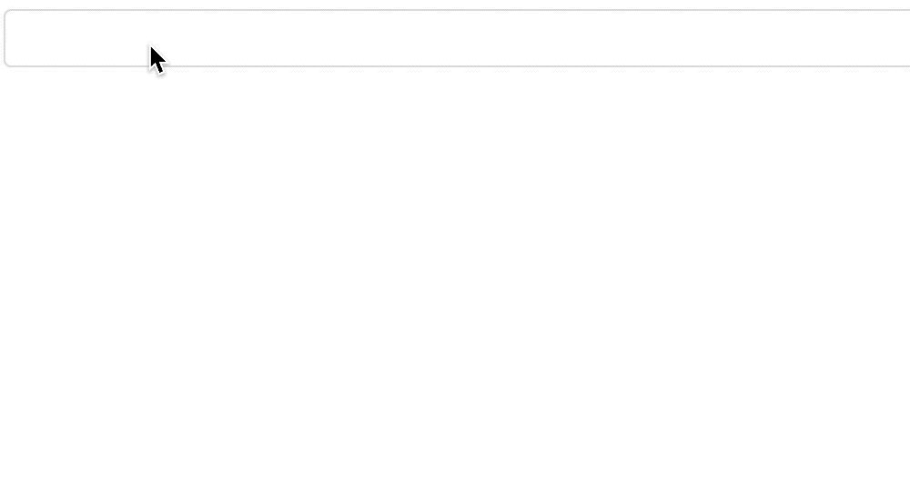

# vue-tag-fields

[![NPM version][npm-image]][npm-url]
[![build status][travis-image]][travis-url]
[![Test coverage][codecov-image]][codecov-url]


[npm-image]: https://img.shields.io/npm/v/vue-tag-fields.svg?style=flat-square
[npm-url]: https://npmjs.org/package/vue-tag-fields
[travis-image]: https://img.shields.io/travis/Mayness/vue-tag-fields.svg
[travis-url]: https://travis-ci.org/Mayness/vue-tag-fields
[codecov-image]: https://img.shields.io/codecov/c/github/Mayness/vue-tag-fields.svg?style=flat-square
[codecov-url]: https://codecov.io/github/Mayness/vue-tag-fields?branch=master

## 简介
带tag标签的可增删改的vue input输入框样式的组件


## 使用
[](https://nodei.co/npm/vue-tag-fields/)

```js
// Vue.use引入
import TagFields from 'vue-tag-fields';
Vue.use(TagFields);

// 组件自定义引入
import { TagFields } from 'vue-tag-fields';
```
```html
<tag-fields v-model="data"></tag-fields>
```

## 操作
新增tag：输入完成后回车增加  
修改tag：点击tag出现输入框，修改完成后回车确定修改。  

## API

属性  
  
|属性|说明|类型|默认值|  
|---|--|--|--|
|v-model|双向绑定的值，数组中的值需要为``String``类型|Array|[]|
|placeholder|占位文本|String|-|
|disabled|是否禁用|Boolean|-|
|ready-only|给定的初始值仅可读，不能修改或删除|Boolean|false|
|allow-duplicates|是否允许出现重复的值，如果重复则无法添加|Boolean|true|
|onblur-append|输入框失去焦点时，是否添加当前输入字符|Boolean|false|
|max-tag-length|tag最多可以有多少个|Number|-
|before-change|用于数据添加前的钩子函数，返回添加的``value``和``index``，该函数应该返回``true``或``false``，表示是否应用添加。当删除元素的时候，``value``值为``undefined``。用于自定义校验时，不要设置``ready-only``或``max-tag-length``属性|Function|-|  


方法 

|方法名|说明|返回值|
|--|--|--|
|change|数据改变时触发|操作的值value、下标index、当前值data|  
